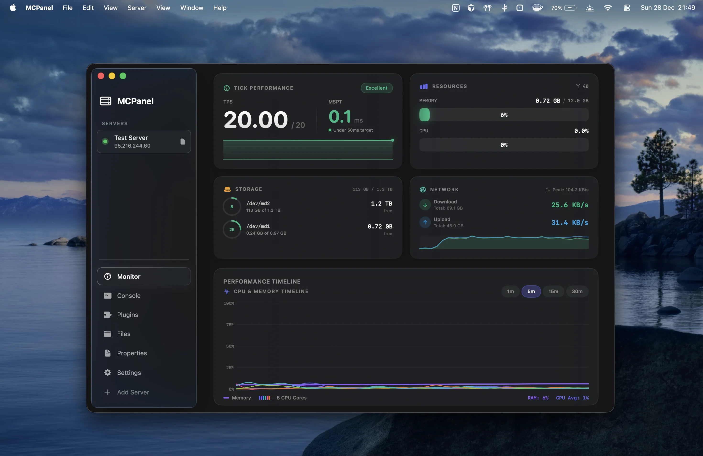
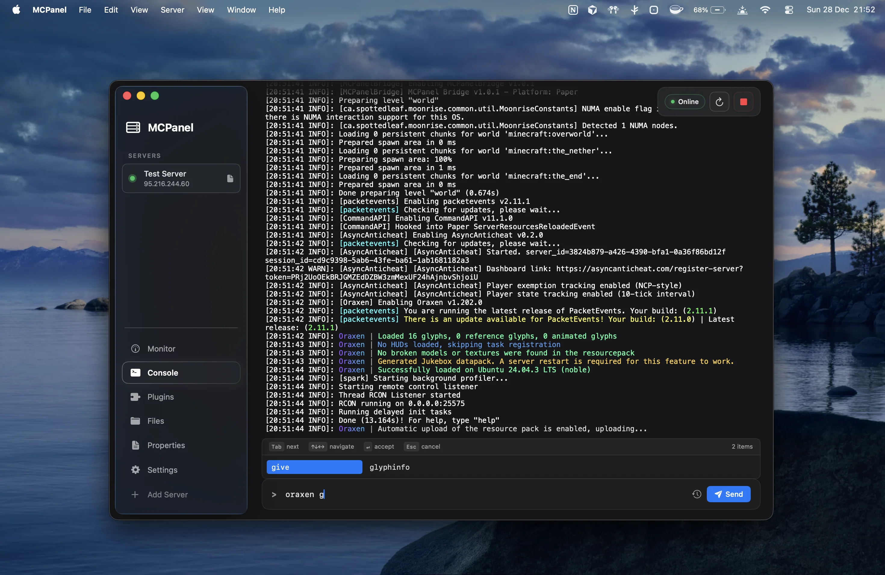
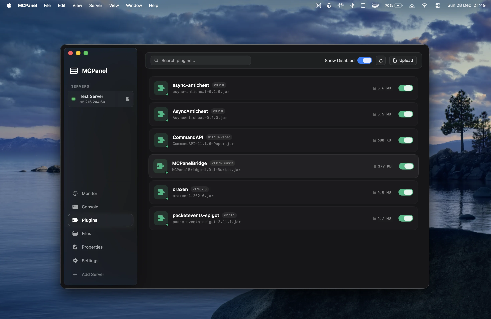
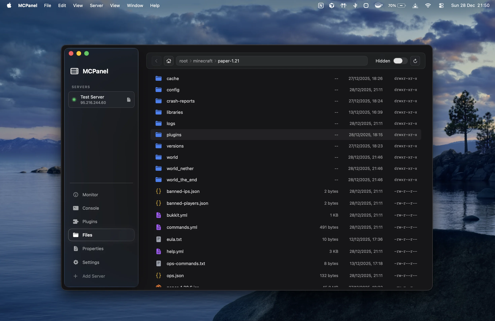
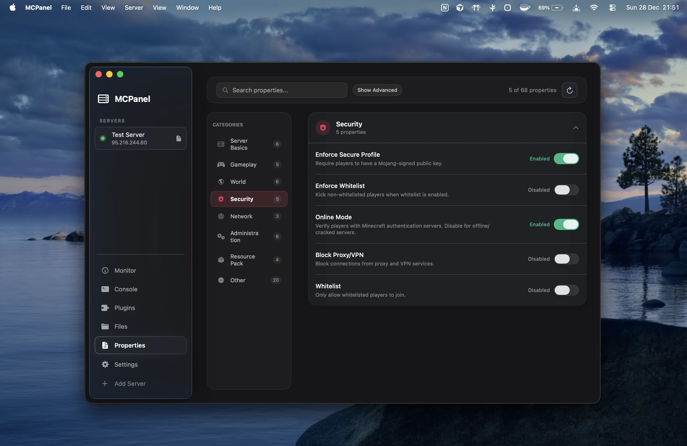
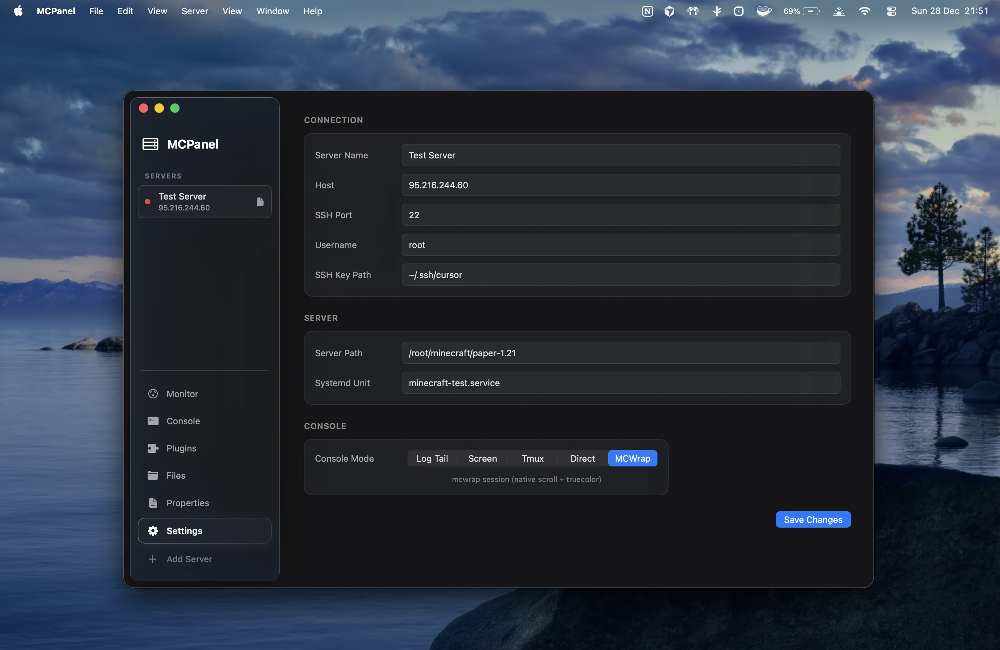

<p align="center">
  
</p>

<h1 align="center">MCPanel</h1>

<p align="center">
  <strong>Open source</strong> macOS Minecraft server control panel. Beautiful. Minimal. Native.
</p>

<p align="center">
  <a href="#screenshots">Screenshots</a> · <a href="#features">Features</a> · <a href="#building">Build</a>
</p>

---

## Screenshots

<p align="center">
  
</p>

<p align="center">
  <b>Monitor</b> - Real-time TPS, memory, storage, network stats, and performance timeline
</p>

<br>

<p align="center">
  
</p>

<p align="center">
  <b>Console</b> - Live console with full truecolor ANSI support and command autocomplete
</p>

<br>

<table>
  <tr>
    <td width="50%">
      
      <p align="center"><b>Plugins</b> - One-click enable/disable</p>
    </td>
    <td width="50%">
      
      <p align="center"><b>Files</b> - Native file browser</p>
    </td>
  </tr>
  <tr>
    <td width="50%">
      
      <p align="center"><b>Properties</b> - Visual config editor</p>
    </td>
    <td width="50%">
      
      <p align="center"><b>Settings</b> - Connection configuration</p>
    </td>
  </tr>
</table>

---

## What is this?

MCPanel is a native macOS application for managing remote Minecraft servers. It provides a clean, minimal interface with a liquid glass aesthetic that feels right at home on macOS.

This project is **fully open source**. Clone it, build it, modify it, use it however you like.

## Features

| Feature | Description |
|---------|-------------|
| **Multi-Server** | Manage multiple remote Minecraft servers |
| **Live Console** | Real-time log streaming with 24-bit truecolor ANSI support |
| **Server Monitor** | TPS, memory, CPU, storage, and network metrics at a glance |
| **Plugin Manager** | Enable/disable plugins with a single click |
| **File Browser** | Native macOS-style file explorer for server files |
| **Properties Editor** | Visual editor for server.properties with categories |
| **Version Manager** | Download and update server JARs via mcjarfiles.com |

## Requirements

- macOS 14.0+ (Sonoma)
- SSH access to your Minecraft server
- Optional: MCPanelBridge plugin for real-time metrics

## MCPanelBridge Plugin

For enhanced server monitoring (TPS, memory, player events), install the companion plugin:

| Platform | Download |
|----------|----------|
| **Bukkit/Paper** | [MCPanelBridge-Bukkit.jar](https://github.com/Th0rgal/mcpanel/releases/latest/download/MCPanelBridge-Bukkit.jar) |
| **Velocity** | [MCPanelBridge-Velocity.jar](https://github.com/Th0rgal/mcpanel/releases/latest/download/MCPanelBridge-Velocity.jar) |

Place the JAR in your server's `plugins/` folder and restart.

## Building

### Quick Build

```bash
./build-app.sh
```

This will:
1. Build the app in release mode
2. Create the `MCPanel.app` bundle
3. Launch the app automatically

### Clean Rebuild

```bash
swift package clean && rm -rf .build MCPanel.app && ./build-app.sh
```

## Configuration

Server configurations are stored in:
```
~/Library/Application Support/MCPanel/
```

SSH credentials are stored securely in macOS Keychain.

## Keyboard Shortcuts

| Key | Action |
|-----|--------|
| `⌘N` | Add new server |
| `⌘⌫` | Remove selected server |
| `⌘R` | Restart server |
| `⌘.` | Stop server |
| `⌘⏎` | Send console command |
| `⌘1-9` | Quick switch servers |

## Project Structure

```
mcpanel/
├── mcpanel/
│   ├── Models/           # Server, Plugin, ConsoleMessage
│   ├── Services/         # SSH, RCON, FileTransfer, Persistence
│   ├── Views/            # SwiftUI views
│   └── Assets.xcassets/  # App icons and colors
├── build-app.sh          # Build script
└── Package.swift         # Swift Package Manager config
```

---

<p align="center">
  <sub>Created by <a href="https://thomas.md">Th0rgal</a> • Also check out <a href="https://oraxen.com">Oraxen</a>, <a href="https://mcserverjars.com">MCServerJars</a>, and <a href="https://hackedserver.org">HackedServer</a></sub>
</p>
